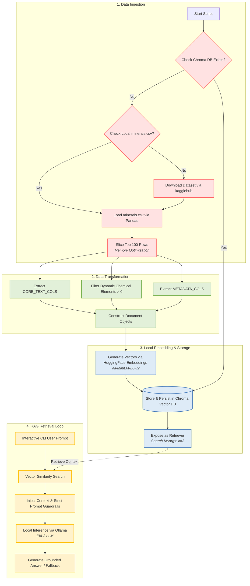

# Local RAG System for Mineral Database

[](https://www.python.org/)
[](https://python.langchain.com/)
[-black?style=flat&logo=ollama&logoColor=white)](https://ollama.ai/)
[](https://www.trychroma.com/)

An enterprise-grade, privacy-focused Local Retrieval-Augmented Generation (RAG) interactive command-line system engineered for querying mineralogical data. Powered by LangChain, Ollama (`phi3`), HuggingFace Embeddings (`all-MiniLM-L6-v2`), and ChromaDB, this system runs fully offline on edge devices without relying on external cloud LLM APIs.

---

## Table of Contents

- [Project Overview](#project-overview)
- [Key Architectural Workflow](#key-architectural-workflow)
- [Prerequisites & Setup](#prerequisites--setup)
- [Installation & Quickstart Guide](#installation--quickstart-guide)
- [Project Directory Structure](#project-directory-structure)
- [Configuration & Parameters](#configuration--parameters)
- [Implementation Code Snippet](#implementation-code-snippet)
- [Troubleshooting & Performance Notes](#troubleshooting--performance-notes)

---

## Project Overview

The Local RAG System for Mineral Database provides deterministic, hallucination-resistant query-answering over mineral datasets. Raw data is automatedly ingested via local `minerals.csv` (or downloaded via `kagglehub`), transformed into structured `Document` objects with categorized text fields, metadata dictionaries, and dynamic chemical composition elements (> 0), embedded locally into dense vector spaces, and stored within a persistent Chroma vector database (`./chroma_db`). Upon user query execution, relevant mineral context is retrieved via vector similarity search and fed to a local Phi-3 small language model served by Ollama to synthesize accurate, grounded answers in an interactive CLI loop.

Key Features:
- **100% Air-Gapped Execution:** Operates entirely locally with zero telemetry or data egress to third-party endpoints.
- **Local Dataset Priority:** Prioritizes local `minerals.csv` to bypass Kaggle API authentication limits (403 Forbidden).
- **Categorized Document Construction:** Maps core physical/optical properties into `page_content` and numerical properties into `metadata` with dynamic chemical element filtering.
- **Persistent Caching:** Vector embeddings are computed once and cached on disk in `./chroma_db` for near-instantaneous startup on subsequent runs.
- **Interactive CLI Interface:** Supports continuous, interactive user prompts in English with exit handling (`exit` / `quit`).
- **Strict Guardrails:** Configured to strictly answer from retrieved context and fallback to `"I cannot answer this question based on the provided context."` when context is insufficient.

---

## Key Architectural Workflow

The system processes data linearly through an ingestion pipeline, caches embeddings in a persistent vector database, and executes a deterministic interactive retrieval loop for grounded generation.



---

## Prerequisites & Setup

### System Requirements
- **OS:** Linux / macOS / Windows 10 or 11 (WSL2 recommended)
- **Memory:** Minimum 8GB system RAM
- **GPU:** Minimum 4GB VRAM (Optional; CPU-only execution supported)
- **Python:** 3.10 or higher

### Step 1: Install Ollama & Pull Phi-3 Model
Install Ollama from [ollama.com](https://ollama.com) and pull the default quantized Phi-3 model:

```bash
ollama pull phi3
```

Ensure the Ollama service is running in the background before starting the application:

```bash
ollama serve
```

### Step 2: Configure Environment & Virtual Environment
Create and activate a Python virtual environment:

```bash
python -m venv venv
source venv/bin/activate  # On Windows: venv\Scripts\activate
```

> [!NOTE]
> If a local `minerals.csv` file is present in the repository root directory, `app.py` will load it directly and bypass Kaggle downloading.

---

## Installation & Quickstart Guide

### 1. Install Dependencies

Install the required packages using `pip`:

```bash
pip install pandas langchain langchain-community langchain-chroma langchain-huggingface langchain-ollama sentence-transformers kagglehub
```

### 2. Run the Application

Execute the interactive command-line interface:

```bash
python app.py
```

```text
==================================================
 Mineral Database RAG Retrieval System (CLI)
==================================================
System ready! You can ask your questions at any time.

Enter your mineral question (type 'exit' or 'quit' to leave): What are the optical properties and refractive index of Quartz?
```

> [!IMPORTANT]
> Ensure Ollama is running (`ollama serve`) before executing `python app.py`.

---

## Project Directory Structure

```text
mineral-rag/
│
├── chroma_db/               # Local persistent storage directory for ChromaDB embeddings
├── minerals.csv             # Local CSV dataset (Optional; loaded directly if present)
├── app.py                   # Main Python application entrypoint execution script
├── README.md                # System technical documentation and workflow specifications
└── requirements.txt         # Declared python dependencies version sheet
```

---

## Configuration & Parameters

The system behavior can be tuned by modifying parameters globally inside the runtime execution file.

| Parameter | Default Value | Target Component | Purpose |
| :--- | :--- | :--- | :--- |
| `CHROMA_DB_DIR` | `./chroma_db` | Vector Store | Target directory for persisting vector embeddings on disk. |
| `LOCAL_CSV_PATH` | `minerals.csv` | Data Ingestion | Path to local CSV file to prioritize over Kaggle download. |
| `CORE_TEXT_COLS` | `['Name', 'Crystal Structure', ...]` | Document Construction | Core physical properties combined into document `page_content`. |
| `METADATA_COLS` | `['Mohs Hardness', 'Specific Gravity', ...]` | Document Construction | Key numerical attributes stored in document `metadata`. |
| `df.head()` | `100` | Data Preprocessing | Limits initial dataframe rows to fit low-RAM system bounds. |
| `model_name` | `all-MiniLM-L6-v2` | HuggingFaceEmbeddings | Local sentence transformer model for dense vector generation. |
| `model` | `phi3` | ChatOllama | Target local LLM backend optimized for 4GB VRAM. |
| `search_kwargs`| `{"k": 3}` | Chroma VectorDB | Number of highly relevant context snippets retrieved per query. |
| `temperature`  | `0` | ChatOllama LLM | Set to zero to eliminate creative hallucinations and enforce deterministic output. |

---

## Implementation Code Snippet

Below is the complete implementation showing custom `Document` construction, dynamic chemical element filtering, vector caching, prompt guardrails, and interactive CLI in `app.py`:

```python
import os
import pandas as pd
import kagglehub
from langchain_core.documents import Document
from langchain_huggingface import HuggingFaceEmbeddings
from langchain_chroma import Chroma
from langchain_ollama import ChatOllama
from langchain_core.prompts import ChatPromptTemplate
from langchain_core.runnables import RunnablePassthrough
from langchain_core.output_parsers import StrOutputParser

CHROMA_DB_DIR = "./chroma_db"
LOCAL_CSV_PATH = "minerals.csv"

CORE_TEXT_COLS = ['Name', 'Crystal Structure', 'Diaphaneity', 'Optical', 'Refractive Index', 'Dispersion']
METADATA_COLS = ['Name', 'Crystal Structure', 'Mohs Hardness', 'Specific Gravity', 'Calculated Density', 'Molar Mass', 'Molar Volume']
IGNORE_COLS = ['Unnamed: 0', 'count']

def get_or_create_vectorstore(embeddings):
    if os.path.exists(CHROMA_DB_DIR) and os.listdir(CHROMA_DB_DIR):
        print("✓ Loading existing vector store from ./chroma_db ...")
        return Chroma(persist_directory=CHROMA_DB_DIR, embedding_function=embeddings)

    if os.path.exists(LOCAL_CSV_PATH):
        print("✓ Local minerals.csv detected. Loading directly...")
        df = pd.read_csv(LOCAL_CSV_PATH)
    else:
        path = kagglehub.dataset_download("paultimothymooney/minerals-dataset")
        csv_file = [os.path.join(path, f) for f in os.listdir(path) if f.endswith('.csv')][0]
        df = pd.read_csv(csv_file)

    df = df.head(100)
    dynamic_chem_cols = [c for c in df.columns if c not in CORE_TEXT_COLS and c not in METADATA_COLS and c not in IGNORE_COLS]

    documents = []
    for _, row in df.iterrows():
        core_parts = [f"{col}: {row[col]}" for col in CORE_TEXT_COLS if pd.notna(row.get(col)) and str(row.get(col)).strip() != ""]
        chem_parts = [f"{col}: {float(row[col])}" for col in dynamic_chem_cols if pd.notna(row.get(col)) and float(row.get(col, 0)) > 0]
        if chem_parts:
            core_parts.append(f"Chemical Composition: {', '.join(chem_parts)}")

        page_content = ". ".join(core_parts)
        metadata = {col: row[col] for col in METADATA_COLS if pd.notna(row.get(col)) and str(row.get(col)).strip() != ""}
        documents.append(Document(page_content=page_content, metadata=metadata))

    return Chroma.from_documents(documents=documents, embedding=embeddings, persist_directory=CHROMA_DB_DIR)

def main():
    embeddings = HuggingFaceEmbeddings(model_name="all-MiniLM-L6-v2")
    vectorstore = get_or_create_vectorstore(embeddings)
    retriever = vectorstore.as_retriever(search_kwargs={"k": 3})

    llm = ChatOllama(model="phi3", temperature=0)
    template = """Answer the question based ONLY on the following context.
If the context does not contain enough information, state: "I cannot answer this question based on the provided context."

Context:
{context}

Question: {question}
"""
    prompt = ChatPromptTemplate.from_template(template)
    rag_chain = (
        {"context": retriever | (lambda docs: "\n\n".join(d.page_content for d in docs)), "question": RunnablePassthrough()}
        | prompt
        | llm
        | StrOutputParser()
    )

    while True:
        query = input("\nEnter your mineral question (type 'exit' or 'quit' to leave): ").strip()
        if query.lower() in ["exit", "quit"]:
            break
        if query:
            print(rag_chain.invoke(query))

if __name__ == "__main__":
    main()
```

---

## Troubleshooting & Performance Notes

> [!IMPORTANT]
> **Persistent Caching Advantage:**
> The system automatically detects existing vector files in `./chroma_db`. Subsequent runs bypass dataset downloading and embedding recalculation completely, reducing initial startup time from minutes to milliseconds.

### Common Issues & Mitigation

1. **Ollama Connection Refused (`http://localhost:11434`)**
   - **Cause:** The Ollama background service is not active.
   - **Solution:** Execute `ollama serve` in a separate terminal before running the application script.

2. **Phi-3 Model Not Found**
   - **Cause:** The model binary has not been pulled locally.
   - **Solution:** Run `ollama pull phi3` to download the quantized weights (~2.3GB).

3. **Kaggle 403 Forbidden Error**
   - **Cause:** Missing Kaggle authentication credentials during dataset download.
   - **Solution:** Place `minerals.csv` directly in the project root folder. `app.py` will automatically detect and load it.
