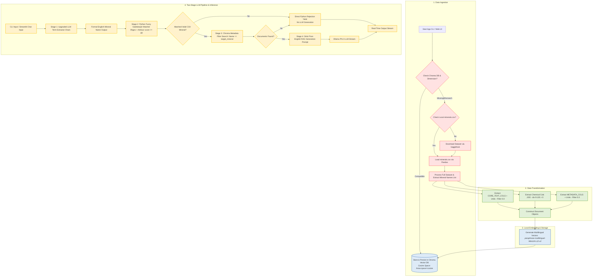

# Local RAG System for Mineral Database

[](https://www.python.org/)
[](https://python.langchain.com/)
[-black?style=flat&logo=ollama&logoColor=white)](https://ollama.ai/)
[](https://www.trychroma.com/)
[](https://streamlit.io/)

An enterprise-grade, privacy-focused Local Retrieval-Augmented Generation (RAG) system engineered for querying mineralogical data via both a terminal CLI debugger and a modern Streamlit Web UI. Powered by LangChain, Ollama (`phi3`), HuggingFace Multilingual Embeddings (`paraphrase-multilingual-MiniLM-L12-v2`), `thefuzz` string matching, and ChromaDB with Metadata Filtering, this system runs fully offline on edge devices without relying on external cloud LLM APIs.

---

## Table of Contents

- [Project Overview](#project-overview)
- [Key Architectural Workflow](#key-architectural-workflow)
- [Prerequisites & Setup](#prerequisites--setup)
- [Installation & Quickstart Guide](#installation--quickstart-guide)
- [Streamlit Web Interface](#streamlit-web-interface)
- [Project Directory Structure](#project-directory-structure)
- [Configuration & Parameters](#configuration--parameters)
- [Implementation Code Snippet](#implementation-code-snippet)
- [Troubleshooting & Performance Notes](#troubleshooting--performance-notes)

---

## Project Overview

The Local RAG System for Mineral Database provides deterministic, hallucination-resistant query-answering over mineral datasets. Raw data is automatedly ingested via local `minerals.csv` (or downloaded via `kagglehub`), transformed into structured `Document` objects with explicit physical units, sanitized metadata dictionaries (excluding zero/null values), and chemical composition elements extracted from CSV columns J to EE (indices 9–135), embedded locally into dense vector spaces via `paraphrase-multilingual-MiniLM-L12-v2`, and stored within a persistent Chroma vector database (`./chroma_db`).

Upon user query execution, a Two-Stage LLM Pipeline with Fuzzy Matching executes:
1. **Stage 1 (LLM Term Extraction & Translation):** A lightweight `translator_chain` powered by Phi-3 translates user query terms into formal English mineralogical names ("Lazurite", "Corundum").
2. **Stage 2 (Python Fuzzy Gatekeeper):** An optimized matcher (`extract_target_mineral`) verifies the extracted English name against valid CSV records using exact regex word boundary matching (`\bname\b`) and `thefuzz` string similarity matching (`fuzz.partial_ratio` / `fuzz.ratio` score $\ge 80$) to resolve subtle spelling, hyphenation, or casing variations.
3. **Stage 3 (Metadata Filtered Vector Retrieval):** Performs exact Chroma vector search (`filter={"Name": target_mineral}`).
4. **Stage 4 (Strict Generation in Pure English):** If matched, streams concise bullet-point responses formatted in pure English rules. If unmatched, bypasses LLM generation and directly yields a hardcoded rejection notice: `⚠️ **Exact data for this mineral is not found in the database. To ensure physical and chemical accuracy, the system declines to answer.**`.

Key Features:
- **Modular Decoupled Codebase:** Cleanly separated into `mineral_rag.py` (core logic), `app_ui.py` (Streamlit UI), and `app_cli.py` (terminal debugger).
- **100% Air-Gapped Execution:** Operates entirely locally with zero telemetry or data egress to third-party endpoints.
- **Fuzzy String Matcher (`thefuzz`):** Integrates fuzzy string similarity matching (threshold score $\ge 80$) to prevent false rejection of valid CSV records due to minor casing, hyphenation, or naming nuances.
- **Two-Stage LLM Pipeline:** Uses LLM term extraction (`translator_chain`) replacing static dictionary aliases.
- **Pure English Output Enforcement:** All output strings, UI elements, rejection messages, and prompt templates are strictly in English.
- **Sanitized Metadata Ingestion:** Filters out zero or `0.0` values from document metadata attributes.
- **Metadata-Filtered Vector Retrieval:** Uses `vectorstore.similarity_search(query, k=3, filter={"Name": target_mineral})` to restrict vector lookup strictly to the identified mineral record.
- **Zero-LLM Hallucination Rejection:** Hardcoded Python string rejection when no valid mineral name is identified in the prompt.
- **Multilingual Dense Embeddings:** Leverages `paraphrase-multilingual-MiniLM-L12-v2` for cross-lingual semantic vector retrieval.

---

## Key Architectural Workflow

The system processes data linearly through an ingestion pipeline, caches embeddings in a persistent vector database, and executes a two-stage LLM retrieval pipeline.



---

## Prerequisites & Setup

### System Requirements
- **OS:** Linux / macOS / Windows 10 or 11 (WSL2 recommended)
- **Memory:** Minimum 8GB system RAM
- **GPU:** Minimum 4GB VRAM (Optional; CPU-only execution supported)
- **Python:** 3.10 or higher

### Step 1: Install Ollama & Pull Phi-3 Model
Install Ollama from [ollama.com](https://ollama.com) and pull the default quantized Phi-3 model:

```bash
ollama pull phi3
```

Ensure the Ollama service is running in the background before starting the application:

```bash
ollama serve
```

### Step 2: Configure Environment & Virtual Environment
Create and activate a Python virtual environment:

```bash
python -m venv venv
source venv/bin/activate  # On Windows: venv\Scripts\activate
```

---

## Installation & Quickstart Guide

### 1. Install Dependencies

Install the required packages using `pip`:

```bash
pip install pandas langchain langchain-community langchain-chroma langchain-huggingface langchain-ollama sentence-transformers kagglehub streamlit thefuzz
```

### 2. Run the Terminal Debugger CLI

Execute the interactive command-line interface:

```bash
python app_cli.py
```

---

## Streamlit Web Interface

Launch the modern chat UI in your browser:

```bash
streamlit run app_ui.py
```

Features of the Web UI:
- **Two-Stage LLM Pipeline:** Uses LLM term extractor chain followed by a fuzzy regex Python gatekeeper.
- **Fuzzy String Matching:** Resolves naming differences via `thefuzz` partial ratio scoring ($\ge 80$).
- **Metadata Filtered Search:** Performs exact metadata lookup (`filter={"Name": target_mineral}`).
- **Strict English Enforcement:** All UI messages, rejection alerts, and generated outputs are in English.
- **Real-time Output Streaming:** `st.write_stream` prevents interface freezing and provides low-latency chat updates.

---

## Project Directory Structure

```text
mineral-rag/
│
├── chroma_db/               # Local persistent storage directory for ChromaDB embeddings
├── minerals.csv             # Local CSV dataset (Optional; loaded directly if present)
├── mineral_rag.py           # Core logic module (embeddings, vectorstore, LLM chains, thefuzz matching)
├── app_cli.py               # Terminal debugger CLI interface script
├── app_ui.py                # Streamlit Web UI chat interface script
├── README.md                # System technical documentation and workflow specifications
└── requirements.txt         # Declared python dependencies version sheet
```

---

## Configuration & Parameters

The system behavior can be tuned by modifying parameters globally inside `mineral_rag.py`.

| Parameter | Default Value | Target Component | Purpose |
| :--- | :--- | :--- | :--- |
| `CHROMA_DB_DIR` | `./chroma_db` | Vector Store | Target directory for persisting vector embeddings on disk. |
| `collection_metadata` | `{"hnsw:space": "cosine"}` | Chroma VectorDB | Distance metric configuration ensuring valid similarity relevance scoring. |
| `EMBEDDING_MODEL_NAME` | `paraphrase-multilingual-MiniLM-L12-v2` | HuggingFaceEmbeddings | Multilingual sentence transformer model for dense vector generation. |
| `LOCAL_CSV_PATH` | `minerals.csv` | Data Ingestion | Path to local CSV file to prioritize over Kaggle download. |
| `fuzzy threshold` | `score >= 80` | Fuzzy Matcher (`thefuzz`) | Similarity score threshold for matching variations of mineral names in CSV. |
| `translator_chain` | `translator_prompt \| llm` | Two-Stage Pipeline | Stage 1 LLM chain for translating and extracting formal English mineral names. |
| `filter` | `{"Name": target_mineral}` | Chroma VectorDB | Metadata filtering restricting vector lookup strictly to identified mineral. |
| `k` | `3` | Chroma VectorDB | Maximum document snippet count retrieved per query. |
| `model` | `phi3` | ChatOllama | Target local LLM backend optimized for 4GB VRAM. |
| `temperature`  | `0` | ChatOllama LLM | Set to zero to eliminate creative hallucinations and enforce deterministic output. |

---

## Implementation Code Snippet

Below is the fuzzy matching and RAG logic in `mineral_rag.py`:

```python
from thefuzz import fuzz, process

def extract_target_mineral(translated_query: str, valid_names: list) -> str | None:
    query_lower = translated_query.lower().strip()
    if not query_lower: return None

    clean_valid_names = [str(n).strip() for n in valid_names if pd.notna(n) and str(n).strip() != ""]

    # 1. Exact Word Boundary Regex Match
    for name_str in sorted(clean_valid_names, key=len, reverse=True):
        if re.search(rf'\b{re.escape(name_str)}\b', query_lower, re.IGNORECASE):
            return name_str

    # 2. Fuzzy String Match using thefuzz (threshold score >= 80)
    best_match = process.extractOne(query_lower, clean_valid_names, scorer=fuzz.partial_ratio)
    if best_match and best_match[1] >= 80:
        return best_match[0]

    best_ratio_match = process.extractOne(query_lower, clean_valid_names, scorer=fuzz.ratio)
    if best_ratio_match and best_ratio_match[1] >= 80:
        return best_ratio_match[0]

    return None
```

---

## Troubleshooting & Performance Notes

> [!IMPORTANT]
> **Persistent Caching Advantage:**
> The system automatically detects existing vector files in `./chroma_db`. Subsequent runs bypass dataset downloading and embedding recalculation completely, reducing initial startup time from minutes to milliseconds.

### Common Issues & Mitigation

1. **Ollama Connection Refused (`http://localhost:11434`)**
   - **Cause:** The Ollama background service is not active.
   - **Solution:** Execute `ollama serve` in a separate terminal before running the application script.

2. **Subtle Mineral Naming Discrepancies**
   - **Cause:** Minor differences in casing, hyphenation, or spelling between queries and CSV records.
   - **Solution:** `thefuzz` similarity score matching ($\ge 80$) dynamically resolves naming variations without false rejections.
