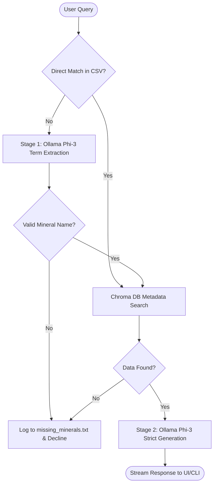
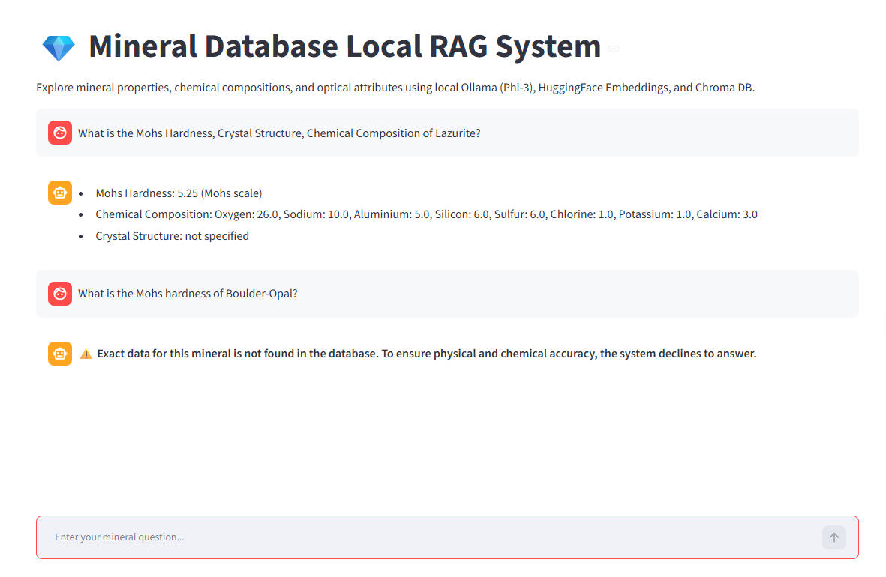

# Local RAG System for Mineral Database

A lightweight local Retrieval-Augmented Generation (RAG) system for querying mineralogical data offline.

## Models & Technical Specifications

* **LLM Model**: Ollama `phi3` (Microsoft Phi-3 Mini 3.8B, running locally)
* **Embedding Model**: `paraphrase-multilingual-MiniLM-L12-v2` (HuggingFace Multilingual Sentence Transformer)
* **Vector Store**: Chroma DB (Cosine similarity space: `hnsw:space=cosine`)
* **Core Frameworks**: LangChain, Pandas, Streamlit, `thefuzz` (fuzzy string matching)

## Setup & Installation

**1. Prerequisites**
* Python 3.10 or higher.
* [Ollama](https://ollama.com/) installed on your machine.

**2. Install Dependencies**
```bash
pip install -r requirements.txt
```
*(Alternatively: `pip install pandas langchain langchain-community langchain-chroma langchain-huggingface langchain-ollama sentence-transformers streamlit thefuzz`)*

**3. Configure Local LLM**
Ensure the Ollama service is running, then pull the required model:
```bash
ollama serve
ollama pull phi3
```

**4. First Launch & Data Ingestion**
Run either the Streamlit Web UI or the Terminal CLI. 
*Note: On the first launch, the system will automatically parse `minerals.csv`, generate embeddings, and build the `./chroma_db` cache. Subsequent launches will load instantly.*
```bash
# Launch the modern Web UI
streamlit run app_ui.py

# OR launch the Terminal Debugger
python app_cli.py
```

## Simplified System Workflow



## Project Directory Structure

```text
mineral-rag/
│
├── chroma_db/               # Local persistent storage directory for ChromaDB embeddings
├── minerals.csv             # Local CSV dataset
├── missing_minerals.txt     # Log file recording unmatched raw queries and extracted terms
├── mineral_rag.py           # Core logic module (embeddings, vectorstore, LLM chains, fuzzy matching)
├── app_cli.py               # Terminal debugger CLI interface script
├── app_ui.py                # Streamlit Web UI chat interface script
├── README.md                # System documentation
└── requirements.txt         # Declared Python dependencies
```

## Searchable Mineral Properties & Data Source

The mineralogy database (`minerals.csv`) used by this local RAG system is sourced from Kaggle's [Comprehensive Database of Minerals](https://www.kaggle.com/datasets/vinven7/comprehensive-database-of-minerals).

The system supports accurate vector retrieval and strict generation across the following core attributes:
- Crystal Structure
- Mohs Hardness
- Diaphaneity
- Specific Gravity
- Optical
- Refractive Index
- Dispersion
- Hydrated Water
- Molar Mass
- Molar Volume
- Calculated Density
- Chemical Composition

## Demo

Streamlit chat UI displaying laser-focused property extraction and zero-hallucination guardrails:

