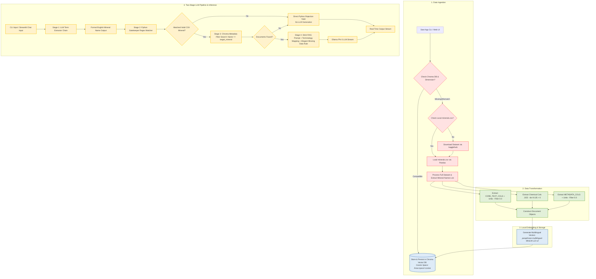

# Local RAG System for Mineral Database

[](https://www.python.org/)
[](https://python.langchain.com/)
[-black?style=flat&logo=ollama&logoColor=white)](https://ollama.ai/)
[](https://www.trychroma.com/)
[](https://streamlit.io/)

An enterprise-grade, privacy-focused Local Retrieval-Augmented Generation (RAG) system engineered for querying mineralogical data via both an interactive CLI and a modern Streamlit Web UI. Powered by LangChain, Ollama (`phi3`), HuggingFace Multilingual Embeddings (`paraphrase-multilingual-MiniLM-L12-v2`), and ChromaDB with Metadata Filtering, this system runs fully offline on edge devices without relying on external cloud LLM APIs.

---

## Table of Contents

- [Project Overview](#project-overview)
- [Key Architectural Workflow](#key-architectural-workflow)
- [Prerequisites & Setup](#prerequisites--setup)
- [Installation & Quickstart Guide](#installation--quickstart-guide)
- [Streamlit Web Interface](#streamlit-web-interface)
- [Project Directory Structure](#project-directory-structure)
- [Configuration & Parameters](#configuration--parameters)
- [Implementation Code Snippet](#implementation-code-snippet)
- [Troubleshooting & Performance Notes](#troubleshooting--performance-notes)

---

## Project Overview

The Local RAG System for Mineral Database provides deterministic, hallucination-resistant query-answering over mineral datasets. Raw data is automatedly ingested via local `minerals.csv` (or downloaded via `kagglehub`), transformed into structured `Document` objects with explicit physical units, sanitized metadata dictionaries (excluding zero/null values), and chemical composition elements extracted from CSV columns J to EE (indices 9–135), embedded locally into dense vector spaces via `paraphrase-multilingual-MiniLM-L12-v2`, and stored within a persistent Chroma vector database (`./chroma_db`).

Upon user query execution, a Two-Stage LLM Pipeline executes:
1. **Stage 1 (LLM Term Extraction & Translation):** A lightweight `translator_chain` powered by Phi-3 translates user query terms (e.g. Traditional Chinese "青金石" or commercial name "Ruby") into formal English mineralogical names ("Lazurite", "Corundum").
2. **Stage 2 (Python Gatekeeper):** An optimized regex matcher (`extract_target_mineral`) verifies the extracted English name against valid CSV records using word boundary matching (`\bname\b`) and length $\ge 4$ protection to prevent short-word false positives.
3. **Stage 3 (Metadata Filtered Vector Retrieval):** Performs exact Chroma vector search (`filter={"Name": target_mineral}`).
4. **Stage 4 (Strict Generation with Elegant Missing Data Handling):** If matched, streams bullet-point responses formatted in exact Traditional Chinese mineralogy terminology. If specific attributes are missing from context, an Elegant Missing Data rule instructs Phi-3 to unify missing properties into a single polite sentence (e.g., `抱歉，資料庫中目前沒有收錄 [礦物英文名]（[中文俗名]）的任何相關紀錄，因此無法為您提供其 [缺失屬性A] 與 [缺失屬性B] 的數據。`) rather than repetitive bullet lines or blank outputs. If unmatched, bypasses LLM generation and directly yields a hardcoded rejection notice: `⚠️ **資料庫中查無此礦物的精確數據。為確保物理與化學參數之嚴謹性，系統拒絕回答。**`.

Key Features:
- **100% Air-Gapped Execution:** Operates entirely locally with zero telemetry or data egress to third-party endpoints.
- **Two-Stage LLM Pipeline:** Uses LLM term extraction (`translator_chain`) replacing static dictionary aliases.
- **Word Boundary & Short-Word Protection:** Regex `extract_target_mineral` matching prevents short name false positives (e.g., "In", "Tin").
- **Elegant Missing Data Handling:** Instructs Phi-3 to combine missing attributes into a single polite, natural response instead of repeating "資料庫無此數據".
- **Sanitized Metadata Ingestion:** Filters out zero or `0.0` values from document metadata attributes.
- **Metadata-Filtered Vector Retrieval:** Uses `vectorstore.similarity_search(query, k=3, filter={"Name": target_mineral})` to restrict vector lookup strictly to the identified mineral record.
- **Zero-LLM Hallucination Rejection:** Hardcoded Python string rejection when no valid mineral name is identified in the prompt.
- **Multilingual Dense Embeddings:** Leverages `paraphrase-multilingual-MiniLM-L12-v2` for cross-lingual semantic vector retrieval.
- **Dual Interface:** Interactive Command-Line Interface (`app.py`) and a real-time streaming Streamlit Web UI (`app_ui.py`).

---

## Key Architectural Workflow

The system processes data linearly through an ingestion pipeline, caches embeddings in a persistent vector database, and executes a two-stage LLM retrieval pipeline.



---

## Prerequisites & Setup

### System Requirements
- **OS:** Linux / macOS / Windows 10 or 11 (WSL2 recommended)
- **Memory:** Minimum 8GB system RAM
- **GPU:** Minimum 4GB VRAM (Optional; CPU-only execution supported)
- **Python:** 3.10 or higher

### Step 1: Install Ollama & Pull Phi-3 Model
Install Ollama from [ollama.com](https://ollama.com) and pull the default quantized Phi-3 model:

```bash
ollama pull phi3
```

Ensure the Ollama service is running in the background before starting the application:

```bash
ollama serve
```

### Step 2: Configure Environment & Virtual Environment
Create and activate a Python virtual environment:

```bash
python -m venv venv
source venv/bin/activate  # On Windows: venv\Scripts\activate
```

---

## Installation & Quickstart Guide

### 1. Install Dependencies

Install the required packages using `pip`:

```bash
pip install pandas langchain langchain-community langchain-chroma langchain-huggingface langchain-ollama sentence-transformers kagglehub streamlit
```

### 2. Run the Command-Line Application

Execute the interactive command-line interface:

```bash
python app.py
```

---

## Streamlit Web Interface

Launch the modern chat UI in your browser:

```bash
streamlit run app_ui.py
```

Features of the Web UI:
- **Two-Stage LLM Pipeline:** Uses LLM term extractor chain followed by a strict regex Python gatekeeper.
- **Metadata Filtered Search:** Performs exact metadata lookup (`filter={"Name": target_mineral}`).
- **Elegant Missing Data Handling:** Combines missing attributes into a unified, natural polite sentence.
- **Real-time Output Streaming:** `st.write_stream` prevents interface freezing and provides low-latency chat updates.

---

## Project Directory Structure

```text
mineral-rag/
│
├── chroma_db/               # Local persistent storage directory for ChromaDB embeddings
├── minerals.csv             # Local CSV dataset (Optional; loaded directly if present)
├── app.py                   # Main Python CLI entrypoint execution script
├── app_ui.py                # Streamlit Web UI chat application
├── README.md                # System technical documentation and workflow specifications
└── requirements.txt         # Declared python dependencies version sheet
```

---

## Configuration & Parameters

The system behavior can be tuned by modifying parameters globally inside the runtime execution file.

| Parameter | Default Value | Target Component | Purpose |
| :--- | :--- | :--- | :--- |
| `CHROMA_DB_DIR` | `./chroma_db` | Vector Store | Target directory for persisting vector embeddings on disk. |
| `collection_metadata` | `{"hnsw:space": "cosine"}` | Chroma VectorDB | Distance metric configuration ensuring valid similarity relevance scoring. |
| `EMBEDDING_MODEL_NAME` | `paraphrase-multilingual-MiniLM-L12-v2` | HuggingFaceEmbeddings | Multilingual sentence transformer model for dense vector generation. |
| `LOCAL_CSV_PATH` | `minerals.csv` | Data Ingestion | Path to local CSV file to prioritize over Kaggle download. |
| `translator_chain` | `translator_prompt \| llm` | Two-Stage Pipeline | Stage 1 LLM chain for translating and extracting formal English mineral names. |
| `filter` | `{"Name": target_mineral}` | Chroma VectorDB | Metadata filtering restricting vector lookup strictly to identified mineral. |
| `k` | `3` | Chroma VectorDB | Maximum document snippet count retrieved per query. |
| `model` | `phi3` | ChatOllama | Target local LLM backend optimized for 4GB VRAM. |
| `temperature`  | `0` | ChatOllama LLM | Set to zero to eliminate creative hallucinations and enforce deterministic output. |

---

## Implementation Code Snippet

Below is the Streamlit Web UI application logic in `app_ui.py`:

```python
import os
import re
import pandas as pd
import streamlit as st
from langchain_huggingface import HuggingFaceEmbeddings
from langchain_chroma import Chroma
from langchain_ollama import ChatOllama
from langchain_core.prompts import ChatPromptTemplate
from langchain_core.output_parsers import StrOutputParser

REJECTION_MESSAGE = "⚠️ **資料庫中查無此礦物的精確數據。為確保物理與化學參數之嚴謹性，系統拒絕回答。**"

strict_rag_template = """...
FORMATTING RULES:
1. When the requested properties exist in the Context, output them using a clear Bullet Points (條列式) format.
2. Do NOT include any introductory prose, conversational filler, or concluding sentences when data IS successfully found.
3. ELEGANT MISSING DATA HANDLING (缺失資料優化):
   - Do NOT output repetitive bullet lines saying "資料庫無此數據" for each missing attribute.
   - If the requested properties/attributes are missing from the Context, combine them into ONE natural, polite, and unified sentence.
   - Standard Response Template:
     "抱歉，資料庫中目前沒有收錄 [礦物英文名]（[中文俗名]）的任何相關紀錄，因此無法為您提供其 [缺失屬性A] 與 [缺失屬性B] 的數據。"
"""
```

---

## Troubleshooting & Performance Notes

> [!IMPORTANT]
> **Persistent Caching Advantage:**
> The system automatically detects existing vector files in `./chroma_db`. Subsequent runs bypass dataset downloading and embedding recalculation completely, reducing initial startup time from minutes to milliseconds.

### Common Issues & Mitigation

1. **Ollama Connection Refused (`http://localhost:11434`)**
   - **Cause:** The Ollama background service is not active.
   - **Solution:** Execute `ollama serve` in a separate terminal before running the application script.

2. **Repetitive "資料庫無此數據" Bullet Lines**
   - **Cause:** LLM generates individual bullet point notes for every missing context property.
   - **Solution:** Rule 3 ELEGANT MISSING DATA HANDLING instructs Phi-3 to combine missing properties into a single polite sentence.
