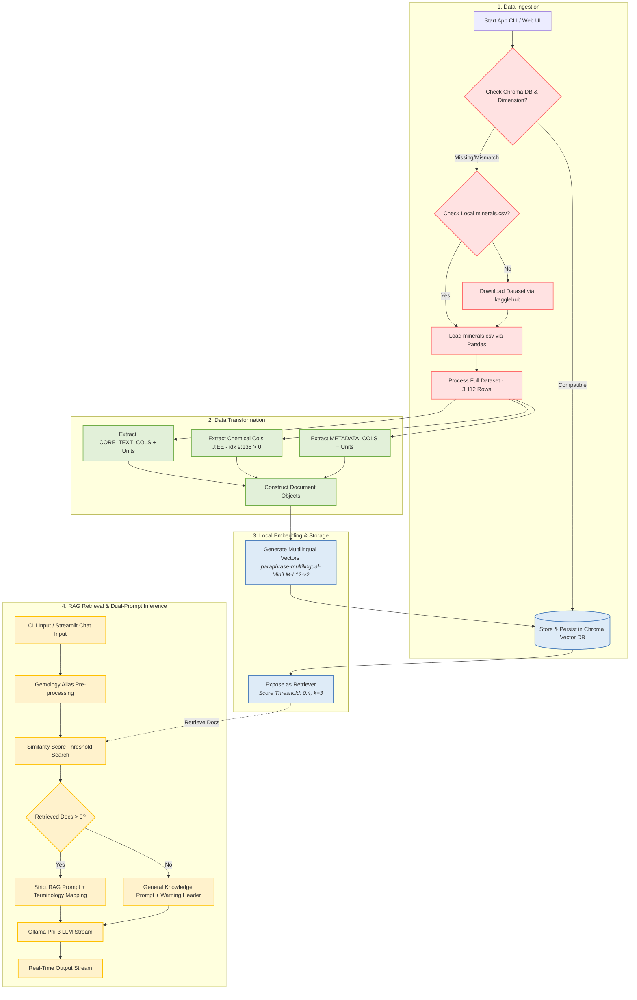

# Local RAG System for Mineral Database

[](https://www.python.org/)
[](https://python.langchain.com/)
[-black?style=flat&logo=ollama&logoColor=white)](https://ollama.ai/)
[](https://www.trychroma.com/)
[](https://streamlit.io/)

An enterprise-grade, privacy-focused Local Retrieval-Augmented Generation (RAG) system engineered for querying mineralogical data via both an interactive CLI and a modern Streamlit Web UI. Powered by LangChain, Ollama (`phi3`), HuggingFace Multilingual Embeddings (`paraphrase-multilingual-MiniLM-L12-v2`), and ChromaDB, this system runs fully offline on edge devices without relying on external cloud LLM APIs.

---

## Table of Contents

- [Project Overview](#project-overview)
- [Key Architectural Workflow](#key-architectural-workflow)
- [Prerequisites & Setup](#prerequisites--setup)
- [Installation & Quickstart Guide](#installation--quickstart-guide)
- [Streamlit Web Interface](#streamlit-web-interface)
- [Project Directory Structure](#project-directory-structure)
- [Configuration & Parameters](#configuration--parameters)
- [Implementation Code Snippet](#implementation-code-snippet)
- [Troubleshooting & Performance Notes](#troubleshooting--performance-notes)

---

## Project Overview

The Local RAG System for Mineral Database provides deterministic, hallucination-resistant query-answering over mineral datasets. Raw data is automatedly ingested via local `minerals.csv` (or downloaded via `kagglehub`), transformed into structured `Document` objects with explicit physical units, metadata dictionaries, and chemical composition elements extracted from CSV columns J to EE (indices 9–135), embedded locally into dense vector spaces via `paraphrase-multilingual-MiniLM-L12-v2`, and stored within a persistent Chroma vector database (`./chroma_db`).

Upon user query execution, similarity search is performed with a strict similarity score threshold (`score_threshold: 0.4`, `k: 3`):
- **When Database Context is Found (`docs > 0`):** Injects context and uses a Strict RAG Prompt to output structured bullet points with exact Traditional Chinese mineralogy terminology.
- **When Database Context is Missing / Below Threshold (`docs == 0`):** Switches to a General Knowledge Fallback Prompt prefixed with `⚠️ 以下為通用科學常識，非資料庫精準數據：` to answer using internal LLM knowledge.

Key Features:
- **100% Air-Gapped Execution:** Operates entirely locally with zero telemetry or data egress to third-party endpoints.
- **Similarity Score Thresholding:** Configured with `search_type="similarity_score_threshold"` (`score_threshold=0.4`) to prevent low-relevance retrieval noise.
- **Conditional Dual-Prompt Architecture:** Routes queries to Strict RAG Chain when context is matched, or General Knowledge Fallback Chain prefixed with warning headers when context is absent.
- **Multilingual Dense Embeddings:** Leverages `paraphrase-multilingual-MiniLM-L12-v2` for cross-lingual semantic vector retrieval.
- **Targeted Chemical Composition Ingestion:** Slices CSV columns J to EE (indices 9 to 135) to capture element composition (> 0).
- **Dual Interface:** Interactive Command-Line Interface (`app.py`) and a real-time streaming Streamlit Web UI (`app_ui.py`).
- **Real-Time Output Streaming:** `st.write_stream` ensures low-latency responsive chat rendering without UI freezing.

---

## Key Architectural Workflow

The system processes data linearly through an ingestion pipeline, caches embeddings in a persistent vector database, and executes a deterministic interactive retrieval loop with similarity score threshold routing.



---

## Prerequisites & Setup

### System Requirements
- **OS:** Linux / macOS / Windows 10 or 11 (WSL2 recommended)
- **Memory:** Minimum 8GB system RAM
- **GPU:** Minimum 4GB VRAM (Optional; CPU-only execution supported)
- **Python:** 3.10 or higher

### Step 1: Install Ollama & Pull Phi-3 Model
Install Ollama from [ollama.com](https://ollama.com) and pull the default quantized Phi-3 model:

```bash
ollama pull phi3
```

Ensure the Ollama service is running in the background before starting the application:

```bash
ollama serve
```

### Step 2: Configure Environment & Virtual Environment
Create and activate a Python virtual environment:

```bash
python -m venv venv
source venv/bin/activate  # On Windows: venv\Scripts\activate
```

---

## Installation & Quickstart Guide

### 1. Install Dependencies

Install the required packages using `pip`:

```bash
pip install pandas langchain langchain-community langchain-chroma langchain-huggingface langchain-ollama sentence-transformers kagglehub streamlit
```

### 2. Run the Command-Line Application

Execute the interactive command-line interface:

```bash
python app.py
```

---

## Streamlit Web Interface

Launch the modern chat UI in your browser:

```bash
streamlit run app_ui.py
```

Features of the Web UI:
- **Conditional Dual-Prompt Output:** Streams database grounded answers in bullet points or falls back to general knowledge with a warning header.
- **Real-time Output Streaming:** `st.write_stream` prevents interface freezing and provides low-latency chat updates.
- **Cached Vector Operations:** `@st.cache_resource` prevents re-indexing data on user actions.

---

## Project Directory Structure

```text
mineral-rag/
│
├── chroma_db/               # Local persistent storage directory for ChromaDB embeddings
├── minerals.csv             # Local CSV dataset (Optional; loaded directly if present)
├── app.py                   # Main Python CLI entrypoint execution script
├── app_ui.py                # Streamlit Web UI chat application
├── README.md                # System technical documentation and workflow specifications
└── requirements.txt         # Declared python dependencies version sheet
```

---

## Configuration & Parameters

The system behavior can be tuned by modifying parameters globally inside the runtime execution file.

| Parameter | Default Value | Target Component | Purpose |
| :--- | :--- | :--- | :--- |
| `CHROMA_DB_DIR` | `./chroma_db` | Vector Store | Target directory for persisting vector embeddings on disk. |
| `EMBEDDING_MODEL_NAME` | `paraphrase-multilingual-MiniLM-L12-v2` | HuggingFaceEmbeddings | Multilingual sentence transformer model for dense vector generation. |
| `LOCAL_CSV_PATH` | `minerals.csv` | Data Ingestion | Path to local CSV file to prioritize over Kaggle download. |
| `search_type` | `similarity_score_threshold` | Chroma VectorDB | Filtering strategy requiring minimum cosine similarity score. |
| `score_threshold` | `0.4` | Chroma VectorDB | Minimum similarity score bound for valid document retrieval. |
| `k` | `3` | Chroma VectorDB | Maximum document snippet count retrieved per query. |
| `model` | `phi3` | ChatOllama | Target local LLM backend optimized for 4GB VRAM. |
| `temperature`  | `0` | ChatOllama LLM | Set to zero to eliminate creative hallucinations and enforce deterministic output. |

---

## Implementation Code Snippet

Below is the Streamlit Web UI application logic in `app_ui.py`:

```python
import os
import re
import pandas as pd
import streamlit as st
from langchain_huggingface import HuggingFaceEmbeddings
from langchain_chroma import Chroma
from langchain_ollama import ChatOllama
from langchain_core.prompts import ChatPromptTemplate
from langchain_core.output_parsers import StrOutputParser

@st.cache_resource(show_spinner="Initializing RAG components...")
def get_rag_components():
    vectorstore = get_vectorstore()
    retriever = vectorstore.as_retriever(
        search_type="similarity_score_threshold",
        search_kwargs={"score_threshold": 0.4, "k": 3}
    )
    llm = ChatOllama(model="phi3", temperature=0)

    strict_prompt = ChatPromptTemplate.from_template("...") # Strict RAG prompt
    general_prompt = ChatPromptTemplate.from_template("⚠️ 以下為通用科學常識，非資料庫精準數據：\n\nQuestion: {question}") # Fallback prompt

    return retriever, strict_prompt | llm | StrOutputParser(), general_prompt | llm | StrOutputParser()

def get_response_stream(query: str):
    retriever, strict_chain, general_chain = get_rag_components()
    processed_query = preprocess_query(query)
    docs = retriever.invoke(processed_query)

    if docs:
        formatted_context = format_docs(docs)
        return strict_chain.stream({"context": formatted_context, "question": processed_query})
    else:
        return general_chain.stream({"question": processed_query})
```

---

## Troubleshooting & Performance Notes

> [!IMPORTANT]
> **Persistent Caching Advantage:**
> The system automatically detects existing vector files in `./chroma_db`. Subsequent runs bypass dataset downloading and embedding recalculation completely, reducing initial startup time from minutes to milliseconds.

### Common Issues & Mitigation

1. **Ollama Connection Refused (`http://localhost:11434`)**
   - **Cause:** The Ollama background service is not active.
   - **Solution:** Execute `ollama serve` in a separate terminal before running the application script.

2. **No Context Retrieved (`docs == 0`)**
   - **Cause:** Similarity score threshold (0.4) was not met by database entries.
   - **Solution:** System automatically uses the General Knowledge prompt with warning headers. Lower `score_threshold` if wider context matches are desired.
