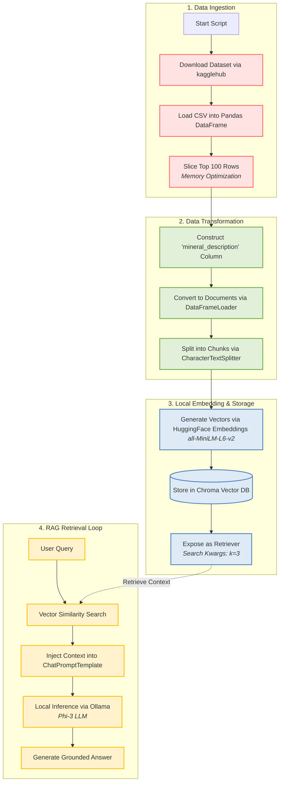

# Local RAG System for Mineral Database

[](https://www.python.org/)
[](https://python.langchain.com/)
[-black?style=flat&logo=ollama&logoColor=white)](https://ollama.ai/)
[](https://www.trychroma.com/)

An enterprise-grade, privacy-focused Local Retrieval-Augmented Generation (RAG) system engineered for querying mineralogical data. Powered by LangChain, Ollama (`phi3`), HuggingFace Embeddings (`all-MiniLM-L6-v2`), and ChromaDB, this system runs fully offline on edge devices without relying on external cloud LLM APIs.

---

## Table of Contents

- [Project Overview](#project-overview)
- [Key Architectural Workflow](#key-architectural-workflow)
- [Prerequisites & Setup](#prerequisites--setup)
- [Installation & Quickstart Guide](#installation--quickstart-guide)
- [Project Directory Structure](#project-directory-structure)
- [Configuration & Parameters](#configuration--parameters)
- [Implementation Code Snippet](#implementation-code-snippet)
- [Troubleshooting & Performance Notes](#troubleshooting--performance-notes)

---

## Project Overview

The Local RAG System for Mineral Database provides deterministic, hallucination-resistant query-answering over mineral datasets. Raw data is automatedly ingested via `kagglehub`, transformed into structured text summaries, embedded locally into dense vector spaces, and stored within a persistent Chroma vector database. Upon user query execution, relevant mineral context is retrieved via vector similarity search and fed to a local Phi-3 small language model served by Ollama to synthesize accurate, grounded answers.

Key Features:
- **100% Air-Gapped Execution:** Operates entirely locally with zero telemetry or data egress to third-party endpoints.
- **Resource-Optimized Pipeline:** Designed to run efficiently on low-resource developer hardware (8GB RAM / 4GB VRAM).
- **Deterministic Grounding:** Temperature-zero inference paired with strict prompt template constraints prevents hallucinated outputs.
- **Persistent Storage:** Vectors are saved on local disk, enabling fast subsequent initializations without re-indexing.

---

## Key Architectural Workflow

The system processes data linearly through an ingestion and chunking pipeline, stores embeddings in a vector database, and executes a deterministic retrieval loop for grounded generation.



---

## Prerequisites & Setup

### System Requirements
- **OS:** Linux / macOS / Windows 10 or 11 (WSL2 recommended)
- **Memory:** Minimum 8GB system RAM
- **GPU:** Minimum 4GB VRAM (Optional; CPU-only execution supported)
- **Python:** 3.10 or higher

### Step 1: Install Ollama & Pull Phi-3 Model
Install Ollama from [ollama.com](https://ollama.com) and pull the default quantized Phi-3 model:

```bash
ollama pull phi3
```

Ensure the Ollama service is running in the background before starting the application:

```bash
ollama serve
```

### Step 2: Configure Environment & Virtual Environment
Create and activate a Python virtual environment:

```bash
python -m venv venv
source venv/bin/activate  # On Windows: venv\Scripts\activate
```

> [!NOTE]
> `kagglehub` automatically manages dataset downloading and caching in `~/.cache/kagglehub`. Public datasets downloaded through `kagglehub` do not require explicit Kaggle API keys or manual authentication.

---

## Installation & Quickstart Guide

### 1. Install Dependencies

Install the required packages using `pip`:

```bash
pip install pandas langchain langchain-community langchain-chroma langchain-huggingface sentence-transformers kagglehub
```

### 2. Run the Application

Execute the main application script:

```bash
python app.py
```

> [!IMPORTANT]
> Ensure Ollama is running (`ollama serve`) before executing `python app.py`.

---

## Project Directory Structure

```text
mineral-rag/
│
├── chroma_db/               # Local persistent storage directory for ChromaDB embeddings
├── app.py                   # Main Python application entrypoint execution script
├── README.md                # System technical documentation and workflow specifications
└── requirements.txt         # Declared python dependencies version sheet
```

---

## Configuration & Parameters

The system behavior can be tuned by modifying parameters globally inside the runtime execution file.

| Parameter | Default Value | Target Component | Purpose |
| :--- | :--- | :--- | :--- |
| `df.head()` | `100` | Data Preprocessing | Limits initial dataframe rows to fit low-RAM system bounds. |
| `chunk_size` | `500` | CharacterTextSplitter | Maximum character count per structural text chunk. |
| `chunk_overlap`| `50` | CharacterTextSplitter | Sliding window overlap to maintain text context between chunks. |
| `model_name` | `all-MiniLM-L6-v2` | HuggingFaceEmbeddings | Local sentence transformer model for dense vector generation. |
| `model` | `phi3` | ChatOllama | Target local LLM backend optimized for 4GB VRAM. |
| `search_kwargs`| `{"k": 3}` | Chroma VectorDB | Number of highly relevant context snippets retrieved per query. |
| `temperature`  | `0` | ChatOllama LLM | Set to zero to eliminate creative hallucinations and enforce deterministic output. |

---

## Implementation Code Snippet

Below is a reference implementation showing how the ingestion, preprocessing, vector storage, and RAG retrieval chain are integrated in `app.py`:

```python
import os
import kagglehub
import pandas as pd
from langchain_community.document_loaders import DataFrameLoader
from langchain_text_splitters import CharacterTextSplitter
from langchain_huggingface import HuggingFaceEmbeddings
from langchain_chroma import Chroma
from langchain_community.chat_models import ChatOllama
from langchain_core.prompts import ChatPromptTemplate
from langchain_core.runnables import RunnablePassthrough
from langchain_core.output_parsers import StrOutputParser

# 1. Data Ingestion
path = kagglehub.dataset_download("paultimothymooney/minerals-dataset")
csv_file = [os.path.join(path, f) for f in os.listdir(path) if f.endswith('.csv')][0]
df = pd.read_csv(csv_file)

# Memory Optimization: Slice top 100 rows
df = df.head(100)

# 2. Data Transformation
df['mineral_description'] = df.apply(
    lambda row: f"Mineral Name: {row.get('name', 'N/A')}. "
                f"Formula: {row.get('formula', 'N/A')}. "
                f"Properties: {row.get('properties', 'N/A')}",
    axis=1
)

loader = DataFrameLoader(df, page_content_column="mineral_description")
documents = loader.load()

text_splitter = CharacterTextSplitter(chunk_size=500, chunk_overlap=50)
docs = text_splitter.split_documents(documents)

# 3. Local Embedding & Storage
embeddings = HuggingFaceEmbeddings(model_name="all-MiniLM-L6-v2")
vectorstore = Chroma.from_documents(
    documents=docs,
    embedding=embeddings,
    persist_directory="./chroma_db"
)
retriever = vectorstore.as_retriever(search_kwargs={"k": 3})

# 4. RAG Retrieval & Inference Chain
llm = ChatOllama(model="phi3", temperature=0)

template = """Answer the question based only on the following context:
{context}

Question: {question}
"""
prompt = ChatPromptTemplate.from_template(template)

def format_docs(docs):
    return "\n\n".join(doc.page_content for doc in docs)

rag_chain = (
    {"context": retriever | format_docs, "question": RunnablePassthrough()}
    | prompt
    | llm
    | StrOutputParser()
)

if __name__ == "__main__":
    query = "What are the physical properties and formula of Quartz?"
    response = rag_chain.invoke(query)
    print("Response:\n", response)
```

---

## Troubleshooting & Performance Notes

> [!IMPORTANT]
> **Data Slicing Architectural Rationale (`df.head(100)`):**
> Slicing the dataset to the top 100 rows is an intentional architectural safeguard. Parsing thousands of complex mineralogical descriptions creates large vector indexes and high memory pressure during vector search. Constraining the dataset bounds ensures low-latency similarity retrieval and prevents Out-Of-Memory (OOM) errors on systems with 8GB RAM or 4GB VRAM.

### Common Issues & Mitigation

1. **Ollama Connection Refused (`http://localhost:11434`)**
   - **Cause:** The Ollama background service is not active.
   - **Solution:** Execute `ollama serve` in a separate terminal before running the application script.

2. **Phi-3 Model Not Found**
   - **Cause:** The model binary has not been pulled locally.
   - **Solution:** Run `ollama pull phi3` to download the quantized weights (~2.3GB).

3. **High Memory Overhead During Vector Generation**
   - **Cause:** Large batch sizes in sentence-transformers when processing vast datasets.
   - **Solution:** Maintain `df.head(100)` or adjust `chunk_size` upwards to decrease total document count.
