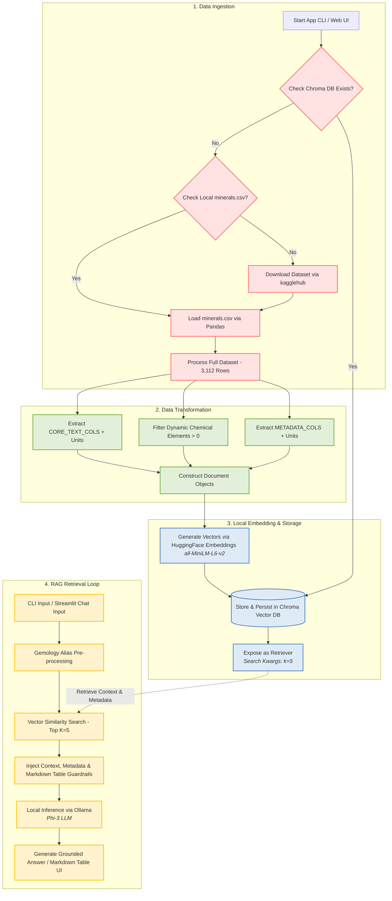

# Local RAG System for Mineral Database

[](https://www.python.org/)
[](https://python.langchain.com/)
[-black?style=flat&logo=ollama&logoColor=white)](https://ollama.ai/)
[](https://www.trychroma.com/)
[](https://streamlit.io/)

An enterprise-grade, privacy-focused Local Retrieval-Augmented Generation (RAG) system engineered for querying mineralogical data via both an interactive CLI and a modern Streamlit Web UI. Powered by LangChain, Ollama (`phi3`), HuggingFace Embeddings (`all-MiniLM-L6-v2`), and ChromaDB, this system runs fully offline on edge devices without relying on external cloud LLM APIs.

---

## Table of Contents

- [Project Overview](#project-overview)
- [Key Architectural Workflow](#key-architectural-workflow)
- [Prerequisites & Setup](#prerequisites--setup)
- [Installation & Quickstart Guide](#installation--quickstart-guide)
- [Streamlit Web Interface](#streamlit-web-interface)
- [Project Directory Structure](#project-directory-structure)
- [Configuration & Parameters](#configuration--parameters)
- [Implementation Code Snippet](#implementation-code-snippet)
- [Troubleshooting & Performance Notes](#troubleshooting--performance-notes)

---

## Project Overview

The Local RAG System for Mineral Database provides deterministic, hallucination-resistant query-answering over mineral datasets. Raw data is automatedly ingested via local `minerals.csv` (or downloaded via `kagglehub`), transformed into structured `Document` objects with explicit physical units, metadata dictionaries, and dynamic chemical composition elements (> 0), embedded locally into dense vector spaces, and stored within a persistent Chroma vector database (`./chroma_db`). Upon user query execution, relevant mineral context is retrieved via vector similarity search ($k=5$) and fed to a local Phi-3 small language model served by Ollama to synthesize accurate, grounded answers formatted in Markdown tables when appropriate.

Key Features:
- **100% Air-Gapped Execution:** Operates entirely locally with zero telemetry or data egress to third-party endpoints.
- **Dual Interface:** Choose between interactive Command-Line Interface (`app.py`) and a modern Streamlit Web UI (`app_ui.py`).
- **Resource Caching:** `@st.cache_resource` prevents re-embedding vector computations across Web UI interactions.
- **Local Dataset Priority:** Prioritizes local `minerals.csv` to bypass Kaggle API authentication limits (403 Forbidden).
- **Full Ingestion Pipeline:** Ingests the full mineral dataset (3,112 rows) into dense vector spaces for maximum dataset coverage.
- **Query Alias Pre-processing:** Maps commercial gem/rock names (e.g., Ruby, Sapphire, Emerald, Amethyst) to formal mineral names.
- **Categorized Document & Metadata Integration:** Includes physical units (e.g., Mohs scale, g/cm³, g/mol) and injects document metadata directly into the retrieval context formatted for LLM inference.
- **Persistent Caching:** Vector embeddings are computed once and cached on disk in `./chroma_db` for near-instantaneous startup on subsequent runs.
- **Strict Guardrails:** Configured to strictly answer from retrieved context and fallback to `"I cannot answer this question based on the provided context."` when context is insufficient.

---

## Key Architectural Workflow

The system processes data linearly through an ingestion pipeline, caches embeddings in a persistent vector database, and executes a deterministic interactive retrieval loop for grounded generation.



---

## Prerequisites & Setup

### System Requirements
- **OS:** Linux / macOS / Windows 10 or 11 (WSL2 recommended)
- **Memory:** Minimum 8GB system RAM
- **GPU:** Minimum 4GB VRAM (Optional; CPU-only execution supported)
- **Python:** 3.10 or higher

### Step 1: Install Ollama & Pull Phi-3 Model
Install Ollama from [ollama.com](https://ollama.com) and pull the default quantized Phi-3 model:

```bash
ollama pull phi3
```

Ensure the Ollama service is running in the background before starting the application:

```bash
ollama serve
```

### Step 2: Configure Environment & Virtual Environment
Create and activate a Python virtual environment:

```bash
python -m venv venv
source venv/bin/activate  # On Windows: venv\Scripts\activate
```

> [!NOTE]
> If a local `minerals.csv` file is present in the repository root directory, `app.py` and `app_ui.py` will load it directly and bypass Kaggle downloading.

---

## Installation & Quickstart Guide

### 1. Install Dependencies

Install the required packages using `pip`:

```bash
pip install pandas langchain langchain-community langchain-chroma langchain-huggingface langchain-ollama sentence-transformers kagglehub streamlit
```

### 2. Run the Command-Line Application

Execute the interactive command-line interface:

```bash
python app.py
```

---

## Streamlit Web Interface

Launch the modern chat UI in your browser:

```bash
streamlit run app_ui.py
```

Features of the Web UI:
- **Interactive Chat Canvas:** Preserves chat history across the active session via `st.session_state`.
- **Cached Vector Operations:** `@st.cache_resource` prevents re-indexing data on user actions.
- **Rich Markdown Rendering:** Renders formatted mineral property tables natively.

---

## Project Directory Structure

```text
mineral-rag/
│
├── chroma_db/               # Local persistent storage directory for ChromaDB embeddings
├── minerals.csv             # Local CSV dataset (Optional; loaded directly if present)
├── app.py                   # Main Python CLI entrypoint execution script
├── app_ui.py                # Streamlit Web UI chat application
├── README.md                # System technical documentation and workflow specifications
└── requirements.txt         # Declared python dependencies version sheet
```

---

## Configuration & Parameters

The system behavior can be tuned by modifying parameters globally inside the runtime execution file.

| Parameter | Default Value | Target Component | Purpose |
| :--- | :--- | :--- | :--- |
| `CHROMA_DB_DIR` | `./chroma_db` | Vector Store | Target directory for persisting vector embeddings on disk. |
| `LOCAL_CSV_PATH` | `minerals.csv` | Data Ingestion | Path to local CSV file to prioritize over Kaggle download. |
| `CORE_TEXT_COLS` | `['Name', 'Crystal Structure', 'Mohs Hardness', ...]` | Document Construction | Core physical/optical properties embedded into `page_content`. |
| `METADATA_COLS` | `['Name', 'Mohs Hardness', 'Specific Gravity', ...]` | Document Construction | Attributes stored in document `metadata` and injected in context. |
| `MINERAL_ALIASES` | `{"ruby": "Corundum", ...}` | Query Preprocessor | Maps commercial gem/rock names to formal mineral names. |
| `model_name` | `all-MiniLM-L6-v2` | HuggingFaceEmbeddings | Local sentence transformer model for dense vector generation. |
| `model` | `phi3` | ChatOllama | Target local LLM backend optimized for 4GB VRAM. |
| `search_kwargs`| `{"k": 5}` | Chroma VectorDB | Number of top relevant document snippets retrieved per query. |
| `temperature`  | `0` | ChatOllama LLM | Set to zero to eliminate creative hallucinations and enforce deterministic output. |

---

## Implementation Code Snippet

Below is the Streamlit Web UI application logic in `app_ui.py`:

```python
import os
import re
import pandas as pd
import kagglehub
import streamlit as st
from langchain_core.documents import Document
from langchain_huggingface import HuggingFaceEmbeddings
from langchain_chroma import Chroma
from langchain_ollama import ChatOllama
from langchain_core.prompts import ChatPromptTemplate
from langchain_core.runnables import RunnablePassthrough
from langchain_core.output_parsers import StrOutputParser

CHROMA_DB_DIR = "./chroma_db"
LOCAL_CSV_PATH = "minerals.csv"

@st.cache_resource(show_spinner="Initializing vector store...")
def get_vectorstore():
    embeddings = HuggingFaceEmbeddings(model_name="all-MiniLM-L6-v2")
    if os.path.exists(CHROMA_DB_DIR) and os.listdir(CHROMA_DB_DIR):
        return Chroma(persist_directory=CHROMA_DB_DIR, embedding_function=embeddings)
    # Full dataset document loading logic...

@st.cache_resource(show_spinner="Initializing LLM chain...")
def get_rag_chain():
    vectorstore = get_vectorstore()
    retriever = vectorstore.as_retriever(search_kwargs={"k": 5})
    llm = ChatOllama(model="phi3", temperature=0)
    # RAG Chain setup...

def main():
    st.set_page_config(page_title="Mineral Database RAG", page_icon="💎", layout="wide")
    st.title("💎 Mineral Database Local RAG System")

    rag_chain = get_rag_chain()
    if "messages" not in st.session_state:
        st.session_state.messages = []

    for message in st.session_state.messages:
        with st.chat_message(message["role"]):
            st.markdown(message["content"])

    if user_input := st.chat_input("Enter your mineral question..."):
        st.session_state.messages.append({"role": "user", "content": user_input})
        with st.chat_message("user"):
            st.markdown(user_input)

        response = rag_chain.invoke(user_input)
        with st.chat_message("assistant"):
            st.markdown(response)
            st.session_state.messages.append({"role": "assistant", "content": response})

if __name__ == "__main__":
    main()
```

---

## Troubleshooting & Performance Notes

> [!IMPORTANT]
> **Persistent Caching Advantage:**
> The system automatically detects existing vector files in `./chroma_db`. Subsequent runs bypass dataset downloading and embedding recalculation completely, reducing initial startup time from minutes to milliseconds.

### Common Issues & Mitigation

1. **Ollama Connection Refused (`http://localhost:11434`)**
   - **Cause:** The Ollama background service is not active.
   - **Solution:** Execute `ollama serve` in a separate terminal before running the application script.

2. **Phi-3 Model Not Found**
   - **Cause:** The model binary has not been pulled locally.
   - **Solution:** Run `ollama pull phi3` to download the quantized weights (~2.3GB).

3. **Streamlit App Performance Delay**
   - **Cause:** Vector store or chain re-initialization on page re-run.
   - **Solution:** `@st.cache_resource` decorators handle caching. Ensure persistent storage is populated in `./chroma_db`.
